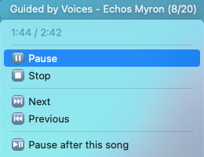

# xbar-mpd-status
An [MPD](https://www.musicpd.org) status plugin for
[xbar](https://xbarapp.com), with some basic controls.

## Installation
```
brew install libmpdclient
make install
```

This will build and install `mpd-status.1s.bin` into
`~/Library/Application Support/xbar/plugins`.

## Notes
- Currently the plugin does no truncation, so if your song info is
  extremely long it will not be displayed at all by xbar.
- The "Pause after this song" feature takes advantage of the one-shot
  single mode added in MPD 0.21. This mode might not be handled
  correctly by your MPD client of choice.
